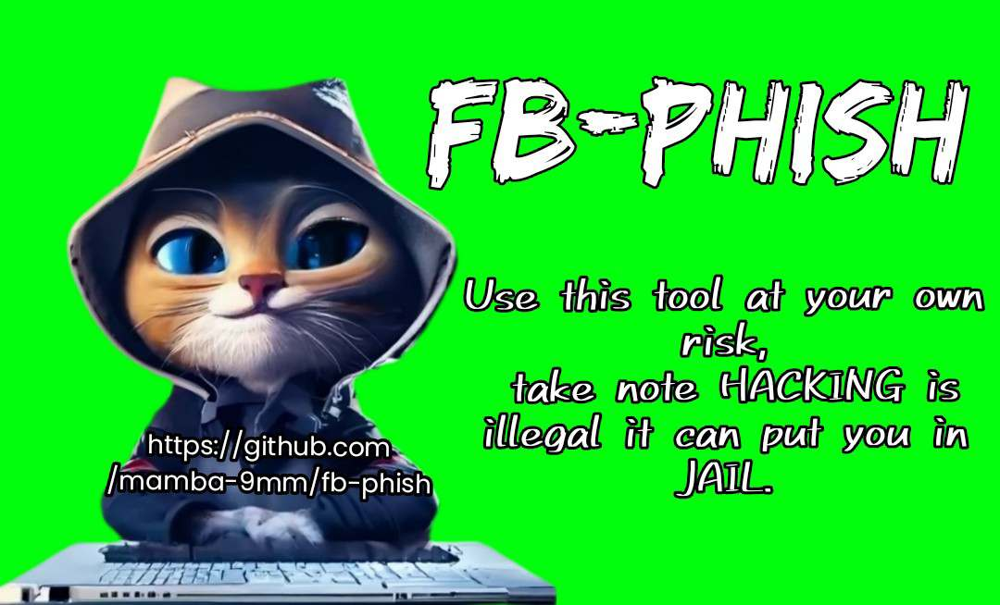

<!-- fb-phish -->

<p align="center">
  
</p>

<p align="center">
  
  
  
  
  
</p>

<p align="center">
  
  
  
  
  

</p>

# <p align="center"> Disclaimer
#### <p align="center">☆ As an Author of FB-PHISH ☆
<p align="center">This facebook phishing tool is really work, and this tool contains materials that can be potentially <b>damaging or dangerous for facebook user's, Author</b> not be held any responsible to users who misused this tool and take note that it can put you in <b>JAIL</b> if you break the law, so think before you made an actions, it only author show's how phishing work.</p>

### TAKE NOTE: 
***Termux discourages hacking*** so never use this tool in a wrong way related to <b>FB-PHISH.</b>
For more check : [wiki](https://wiki.termux.com/wiki/Hacking)

### Features

- Latest and updated login page
- Mask URL support 
- Beginners friendly
- Two tunneling options
  - Localhost
  - Cloudflared

### Dependencies

**`fb-phish`** requires following programs to run properly - 
- `php`
- `wget`
- `curl`
- `git`

> All the dependencies will be installed automatically when you run `fb-phish` for the first time.
> Supported Platform : **`Termux`**, **`Ubuntu/Debian/Kali`**, **`Arch Linux/Manjaro`**, **`Fedora`**


### Installation

-Install the command below-
```
apt update && apt upgrade
pkg install git
pkg install wget
pkg install curl
pkg install php
```
- Just, Clone this repository -
```
git clone https://github.com/mamba-9mm/fb-phish.git
```

- continue to run `fb-phish` -
```
cd fb-phish
bash fb-phish.sh
```

- On first launch, It'll install the dependencies and that's it. `fb-phish` is installed.


### Find Me on :
<p align="left">
  <a href="https://github.com/mamba-9mm" target="_blank"></a>
  <a href="https://instagram.com/mamba9mm?igshid=MzMyNGUyNmU2YQ==" target="_blank"></a>
  <a href="https://m.me/mambamentality9mm" target="_blank"></a>
</p>


<!-- \\ -->


